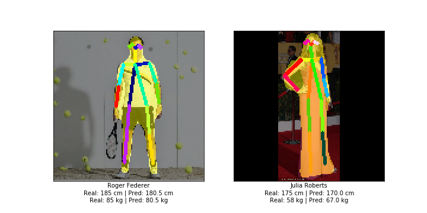

# Height & Weight Finder

 

This is a Python script to find height, weight, segmentation mask and joint locations of a person from a full-body single person image. Used networks are implemented in "_Height and Weight Estimation From Unconstrained Images_" paper. You can find this paper's repository [here](https://github.com/canaltinigne/DeepHeightWeight/).

## Trained Models in the Original Paper

Each file is nearly 2GB. Just download them and put them in `/models` folder.
- Pretrained Height Network: [https://drive.google.com/open?id=1fX0DDgbTcOOmiz9KdtU7I2YYg5S49upj](https://drive.google.com/open?id=1fX0DDgbTcOOmiz9KdtU7I2YYg5S49upj)
- Pretrained Weight Network: [https://drive.google.com/open?id=14ShT0rsUohiGT0wJlKY9cGHgEy0w4Ity](https://drive.google.com/open?id=14ShT0rsUohiGT0wJlKY9cGHgEy0w4Ity)

## Dependency
- PyTorch = 1.2.0
- Python = 3.6

## Usage

In order to get outputs, just run `python HWFinder.py -i [IMAGE ADDRESS] -g [GPU NUMBER] -r [RESOLUTION]`. The models are trained using images with a resolution of `128x128`, so set the `RESOLUTION` parameter between 128 and 256.

## Environment

You can use `environment.yml` file to create a Conda environment to run the script. You can create a new environment using this command. `conda env create -f environment.yml -p [PATH]`
